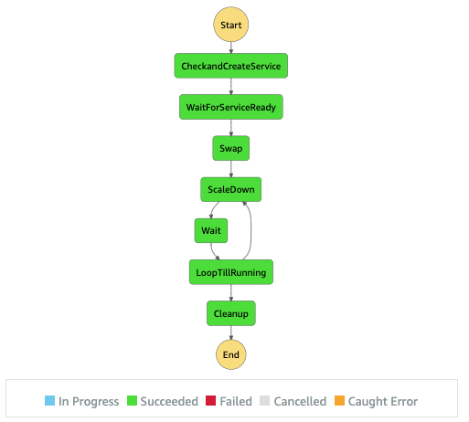

# Deployments on Amazon Elastic Container Services over NLB and Fargate with controlled scaledown

When you're using a Network Load Balancer (NLB) and have long-running connections, closing all tasks at once will cause a spike in new inbound connections. This has the potential to overload your service or cause unnecessary scale-up/increased latencies.
This aws-samples show on how you can control the tasks running with [AWS Fargate](https://docs.aws.amazon.com/AmazonECS/latest/userguide/index.html) on an [Amazon Elastic Container Service](https://docs.aws.amazon.com/AmazonECS/latest/developerguide/Welcome.html) (ECS) cluster through an [_external deployment_](https://docs.aws.amazon.com/AmazonECS/latest/developerguide/deployment-type-external.html) controller, adding some capabilities that isn't currently possible through the CodeDeploy integration. 
It's aimed at being triggered from a CI/CD pipeline, and the coordination of the [AWS Lambdas](https://docs.aws.amazon.com/lambda/latest/dg/welcome.html) involved is done through an  [AWS Step Function](https://docs.aws.amazon.com/step-functions/latest/dg/welcome.html), which allow the control over the whole process. 

## Pre-Requisites
This example uses :
1. [AWS Command Line Interface](http://docs.aws.amazon.com/cli/latest/userguide/cli-chap-welcome.html) this has been tested with ``aws --version >= 2.2.47`` / [Install](http://docs.aws.amazon.com/cli/latest/userguide/installing.html)
1. [jq](https://stedolan.github.io/jq/) a lightweight and flexible command-line JSON processor  / [Download](https://stedolan.github.io/jq/download/)
1. An S3 bucket, copy/paste the name for the deploy script. If you need to create one you can use : `aws s3api create-bucket --bucket DOC-EXAMPLE-BUCKET` 

Please follow the Install/Download link as needed. 

## Quick setup

#### 1. Clone this repo

```console
git clone https://<repourl>
```

#### 2. Run deploy scripts
```console
./bin/deploy
```

You must provide the following inputs to launch the CloudFormation templates:
  * **CloudFormation Stack Prefix**: The prefix to use for the stacks
  * **S3 Bucket**: S3 Bucket Name that will be used for the artefacts. **Note**: This bucket must be in the same region where you wish to launch the AWS resources created by this template.

The first stack creates the following infrastructure:
  
 - A VPC with 2 public and 2 private subnets with attached NAT GW
 - An ECS cluster 
 - An ECS service called "sample-external-deployment" which runs two Fargate tasks as a [_taskSet_](https://docs.aws.amazon.com/AmazonECS/latest/APIReference/API_TaskSet.html)
 - An NLB to balance traffic between the tasks of the "InitialService" service using two listeners and target groups
 - An IAM Role to be passed for Lambdas to control the ELB and ECS resources

Through the Network Load Balancer (NLB) you can access the sample service.

The second CloudFormation stack creates a Step function that orchestrate three Lambda functions that do the actual control of the deployment. This is the main part of this aws-samples, see section _Implementation Details_ 

#### 3. Run the Step Function
At the end of the bin/deploy script there will be a json outputted, that can be passed to the step functions to launch a deployment, here's an example:

<pre>
{
    "cluster": "sample-infra-Cluster-Wzpt4JQYWfAb",
    "nlb": "arn:aws:elasticloadbalancing:us-east-1:555555555555:loadbalancer/net/sample-LoadB-1234567890abc/1234567890abcdef",
    "task_sg": "sg-1234567890abcdef0",
    "subnets": [
     "subnet-1234567890abcdef0",
     "subnet-1234567890abcdef1"
    ],
    "serviceName": "sample-external-deployment",
    "taskDefinition": "arn:aws:ecs:us-east-1:555555555555:task-definition/sample-infra-TaskDefinition-1234567890ab:1",
    "waitForService": 60,
    "scaledown_decrement": 25,
    "scaledown_wait": 60
}
</pre>

The template is in [step/events/event_template.json](step/events/event_template.json), see below for the detail so the value.

For this sample, the use of the [Step Functions console](https://console.aws.amazon.com/states/home) will bring the visual flow of your Step function. Locate it in the console, and click the start execution and use the output of your cloudformation.
For your automation pipelines, you'll want to integrate the [StartExecution](https://docs.aws.amazon.com/step-functions/latest/apireference/API_StartExecution.html) api to launch it passing the previous json as input.    

## Implementation details



When the Step function is launch, the following steps will run:

1. CheckAndCreateService
    
    Create of a new task set attached to the target group which **does not** have the _isProduction=true_ tags.
    
1. WaitForServiceReady

    Pause for the service to become active, this is controlled by the _waitForService_ parameters to the Step Function.
    
1. Swap

    This step swaps the NLB listener default destination to the target group of the new task set. Since the old tasks are still active, there is **no impact** for existing connections until the ScaleDown step. The _isProduction_ tag is adjusted to the target group receiving new connections.

1. Scale Down

    The scale down starts, which removes tasks by the _scaledown_decrement_ percentage every _scaledown_wait_ in seconds.
1. Wait

    Pause for _scaledown_wait_ seconds, see Scale Down above
    
1. LoopTillRunning

    When there is no more instances running in the old taskSet, proceed to the Cleanup step. Otherwise loop back to Scale Down.

1. Cleanup

    Delete the old taskSet.

## Cleanup
To clean up this sample, remove the artefact from bucket and delete the cloudformation stacks to prevent charges (NAT GW, ECS tasks, NLB, etc). 
